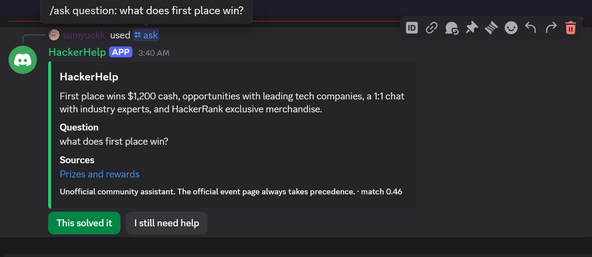
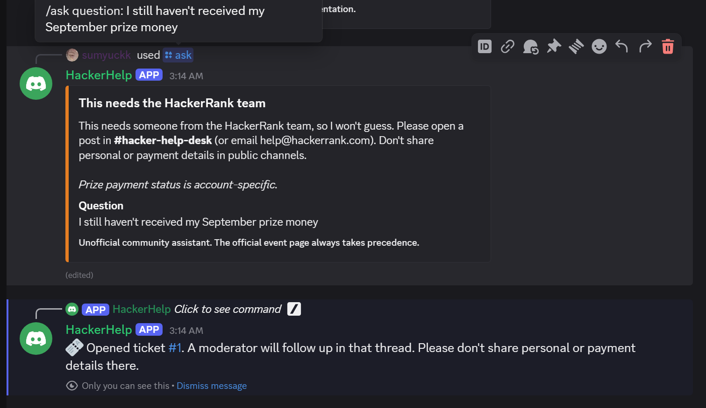
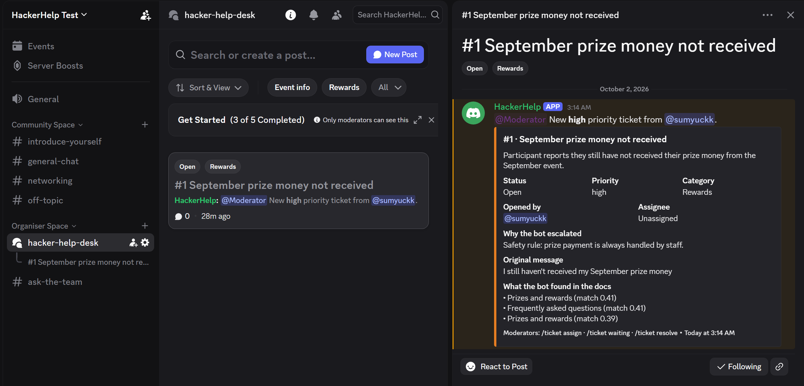
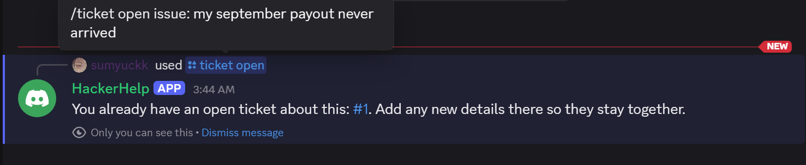

# HackerHelp

**Discord-native AI support and hackathon operations bot.**

HackerHelp answers participant questions in a hackathon Discord server from a curated, cited knowledge base, and hands off to humans when it shouldn't answer. The knowledge base targets [HackerRank Orchestrate](https://www.hackerrank.com/hackerrank-orchestrate-october26), a monthly 24-hour AI agent hackathon whose Discord gets the same questions every edition (dates, prizes, submission format, the AI judge interview), answered by hand by the organizers.

The bot also includes hackathon operations workflows: registration, teams, submissions, judging, announcements, and role-based administration.

> HackerHelp is an independent project. It is not affiliated with or endorsed by HackerRank, and its knowledge base is an unofficial summary of public sources.

## In action

**A grounded answer with its source.** The citation links to the document the answer came from. The buttons record whether it helped, or hand off to a human.



**Sensitive questions go to a human.** Prize-payment status is account-specific, so a deterministic rule escalates it before any model call.



**The ticket moderators receive.** It's a post in `#hacker-help-desk`, tagged by category and status, pinging the moderator role. It shows a neutral summary, why the bot escalated, and what it already found in the docs.



**No duplicate tickets.** The same problem in different words is matched by its canonical issue and pointed back to the existing ticket.



## How a question is answered

```text
Discord /ask or @mention
  │
  ├─ 1. Input bounds ─────────────── empty or > 1500 chars → ask to rephrase
  ├─ 2. Prompt-injection gate ────── "ignore previous instructions…" → refuse (no API calls)
  ├─ 3. Sensitive-case gate ──────── prize payment, account compromise, appeals, score disputes,
  │                                  conduct reports, data requests → always escalate to a human
  ├─ 4. Retrieval ─────────────────── OpenAI embedding → Supabase pgvector (top 6, floor 0.25)
  ├─ 5. Model decision ────────────── Claude, JSON-schema output: answer | clarify | escalate | out_of_scope
  │                                  + cited section IDs + one-line justification
  └─ 6. Validation ────────────────── an answer must cite a section that was actually retrieved and
                                     scores ≥ 0.30, otherwise it is downgraded to an escalation
```

The model proposes and code decides. The model never sees a gated message, so it cannot answer a prize-payment question or be talked out of an escalation. Every answer shows its sources, and every decision is logged with its reason, best similarity, and latency.

Thresholds come from measured data, not guesses: see [eval/RESULTS.md](eval/RESULTS.md). On 41 labelled cases the pipeline chose the correct outcome 41/41 times, and every answer cited an expected source (24/24).

## Features

- **Grounded Q&A**: `/ask` and @mentions, with source links, verification labels for older or community-compiled facts, and a clear handoff when the bot won't answer.
- **Curated knowledge base**: Markdown in [knowledge/](knowledge/) with front matter (source URL, verification level). `npm run kb:ingest` is idempotent: content hashes skip unchanged files, and each document is replaced atomically in one Postgres transaction.
- **Evaluation harness**: `npm run eval:rag` runs 41 labelled cases covering paraphrases, Hinglish, sensitive requests, vague and off-topic messages, and prompt injection.
- **Bounded retries**: Anthropic and OpenAI calls retry transient failures with capped, jittered backoff, and fail fast on quota exhaustion or long `Retry-After` instead of hanging Discord interactions ([src/services/retry.ts](src/services/retry.ts)).
- **Support tickets**: when the bot shouldn't answer, one click opens a ticket as a post in the `#hacker-help-desk` forum. The post is tagged by category and status, pings the moderator role, and carries a neutral AI summary, the reason the bot escalated, and what it found in the docs.
  - **Duplicate detection**: compares canonical issue statements in pgvector. A participant's own repeat is merged into their open ticket; a previously resolved twin is offered first, with an "open anyway" button.
  - **Lifecycle**: `open → assigned → waiting_user → resolved` is enforced by one tested state machine, with moderator-only transitions and optimistic concurrency. A participant replying in a waiting ticket hands it back automatically.
  - **Learning from resolutions**: a moderator can add a resolution to the knowledge base, so the next person gets an answer instead of a ticket.
  - **Deflection first**: `/ticket open` tries the knowledge base first. Answers carry "This solved it" / "I still need help" buttons, and every outcome is recorded as a support event.
- **Support analytics**: moderator-only `/analytics [days]` reports question volume by outcome, the confirmed self-serve rate, tickets by status and category, duplicates prevented, resolutions reused or added to knowledge, median time to first moderator action and to resolution, and the top unresolved issues. Every figure is computed from recorded support events and tickets; the same report is at `GET /api/analytics/support`.
- **Additional sources**: admin upload of PDF, DOCX, Markdown, and text files, and indexing of a channel's recent history. Re-indexing replaces the previous version.
- **Hackathon operations**: registration and profiles, teams (invites, leadership transfer), submissions with version history, judge rubric scoring and AI-assisted summaries, an announcement composer, roles, and audit logging.
- **Operations**: startup config validation, liveness and readiness probes, graceful shutdown, a token-protected admin API, and structured JSON logs.
## Architecture

```text
Discord ──► Discord.js bot ──► answer pipeline ──► Anthropic Claude (decisions, drafting)
                │                     ├──────────► OpenAI (embeddings)
                │                     │
                │                     └──────────► Supabase Postgres + pgvector
                │                                  (documents, sections, ticket vectors)
                ├──► ticket service ─────────────► MongoDB (tickets, support events)
                │      └─ TicketChannel port ────► #hacker-help-desk forum posts
                └──► hackathon services ─────────► MongoDB (users, teams, submissions,
                                                    judging, audit log)
Express: /health, /ready, /api/* (bearer token)
```

See [explanation.md](explanation.md) for the code layout and data flow.

## Tech stack

TypeScript on Node.js 24, Discord.js 14, Anthropic SDK (Claude), OpenAI SDK (embeddings), Supabase (Postgres, pgvector, Storage), MongoDB with Mongoose, Express, Docker Compose, GitHub Actions.

## Setup

### 1. Configure

```bash
git clone https://github.com/sumyuck/HackerHelp.git
cd HackerHelp
npm install
cp .env.example .env
```

| Variable | Purpose |
| --- | --- |
| `DISCORD_TOKEN` | Discord bot token |
| `DISCORD_CLIENT_ID` | Discord application ID |
| `DISCORD_GUILD_ID` | Development server ID for instant command registration; omit to register globally |
| `ANTHROPIC_API_KEY` | Anthropic API key, used for answer decisions and drafting |
| `ANTHROPIC_MODEL` | Optional Claude model; defaults to `claude-haiku-4-5`. Newer models (e.g. `claude-opus-5-5`, used for the recorded evals) also get `effort` and server-side refusal fallback |
| `OPENAI_API_KEY` | OpenAI API key, used for embeddings only |
| `OPENAI_EMBEDDING_MODEL` | `text-embedding-3-small` (the schema uses 1536 dimensions) |
| `MONGODB_URI` | MongoDB connection string (`MONGO_URI` accepted as a legacy fallback) |
| `SUPABASE_URL` | Supabase project URL |
| `SUPABASE_SERVICE_ROLE_KEY` | Supabase service role or secret key (server-side only) |
| `SUPER_ADMIN_IDS` | Comma-separated Discord user IDs with full admin rights |
| `ADMIN_API_TOKEN` | Bearer token (32+ chars) for `/api/*`; the API is disabled if unset. Generate with `node -e "console.log(require('crypto').randomBytes(32).toString('hex'))"` |
| `RAG_RETRIEVAL_FLOOR`, `RAG_ANSWER_MIN_SIMILARITY`, `RAG_TOP_K` | Optional retrieval tuning; defaults 0.25 / 0.30 / 6 |
| `LOG_LEVEL`, `PORT` | Optional; defaults `info` and `3000` |

Startup validates this configuration and exits with a list of every missing or malformed value.

### 2. Supabase

In a new Supabase project's SQL editor, run [supabase/schema.sql](supabase/schema.sql), then each file in [supabase/migrations/](supabase/migrations/) in order. For tickets, create a forum channel named `hacker-help-desk` and a `Moderator` role (or set `TICKET_FORUM_CHANNEL` / `TICKET_MODERATOR_ROLE`), and give the bot Manage Channels and Manage Threads so it can create tags and manage ticket threads. Database functions are executable only by the service role.

If you change the embedding model, update the vector dimensions in the schema and re-run `npm run kb:ingest`. The content hash includes the model name, so every document is re-embedded.

### 3. Discord

In the Developer Portal, enable **Message Content Intent**. Invite the bot with the `bot` and `applications.commands` scopes and permission to view channels, send messages, embed links, and read message history.

### 4. Run

```bash
docker compose up -d --build
docker compose exec app node dist/discord/register-commands.js
docker compose exec app node dist/scripts/ingest-knowledge.js
```

Compose runs the bot and MongoDB. It publishes ports on loopback only, health-checks the app via `/ready`, and restarts it on failure. Without Docker, use `npm run dev` (or `npm run build && npm start`), `npm run register-commands`, and `npm run kb:ingest`.

`npm run seed` adds a sample event and tracks for the hackathon operations commands.

## Scripts

| Script | Purpose |
| --- | --- |
| `npm run dev` / `build` / `start` | Develop, compile, run |
| `npm run register-commands` | Register slash commands |
| `npm run kb:ingest` | Sync `knowledge/` to Supabase (`-- --prune` deletes removed docs, `-- --dry-run` previews) |
| `npm run eval:rag` | Evaluate the answer pipeline (`-- --retrieval-only` makes no chat calls) |
| `npm run eval:dedup` | Calibrate ticket duplicate detection (`-- --canonical` uses the classifier, as production does) |
| `npm run seed` | Sample hackathon data |
| `npm test` | Unit tests: config, API auth, chunking, triage rules, answer pipeline, retry policy. Network calls are mocked. |

Ticket commands: `/ticket open`, `/ticket status`, and for moderators `/ticket assign`, `/ticket waiting`, `/ticket resolve` (optionally `add_to_knowledge_base`), and `/ticket reopen`. Inside a ticket thread the ticket number can be omitted.

Operators can also `POST /api/documents/upload` (multipart `file`, `Authorization: Bearer <ADMIN_API_TOKEN>`). Admins can run `/index channel` in Discord.

## Known limitations

- The knowledge base is hand-curated from public pages and can lag behind HackerRank's official information. Facts from a previous edition are labelled as such in answers.
- Non-English questions retrieve weaker evidence (see eval results). Query rewriting would help at the cost of an extra model call.
- Indexed channel history is community content, not verified fact. It is labelled `community`, and indexing is admin-only.
